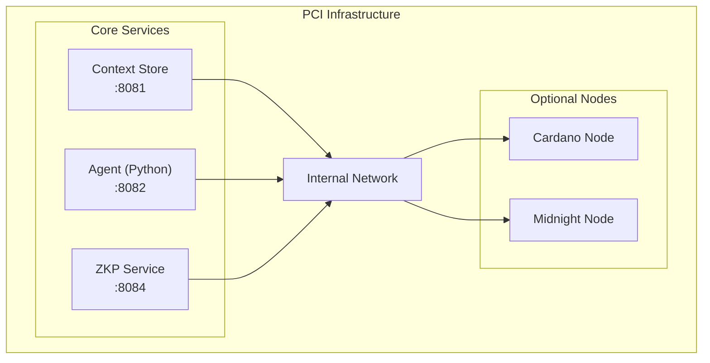

# PCI Infrastructure

Infrastructure orchestration for PCI development and testing.

## Overview

This repo provides:

- **Full-stack orchestration** - Run all PCI services together
- **Development environment** - Hot reload, debugging, local testing
- **Blockchain nodes** - Cardano and Midnight network configuration (Ledger 8.1.0)
- **Deployment scripts** - Contract deployment and setup utilities

## Quick Start

```bash
# First time setup
./scripts/setup.sh

# Start full stack
docker compose up

# Start with blockchain nodes (resource intensive)
docker compose --profile with-nodes up
```

## Architecture



## Services

| Service | Port | Image | Description |
|---------|------|-------|-------------|
| context-store | 8081 | (built locally) | Layer 1: Encrypted vault API |
| agent | 8082 | (built locally) | Layer 2: Personal agent API |
| zkp | 8084 | (built locally) | Layer 4: Zero-knowledge proof service |
| midnight-proof-server | 6300 | `midnightntwrk/proof-server:8.1.0` | ZK proof generation (required for zkp) |
| cardano-node | 3001 | `ghcr.io/intersectmbo/cardano-node:10.4.0` | Cardano preview testnet (optional) |
| midnight-node | 9944 | `midnightntwrk/midnight-node:1.0.1` | Midnight node (Ledger 8.1.0, optional) |
| midnight-indexer | 8088 | `midnightntwrk/indexer-standalone:4.3.3` | Midnight indexer with bundled SQLite storage (optional) |

## Profiles

```bash
# Core services only (lightweight)
docker compose up

# With Cardano preview testnet node
docker compose --profile cardano-testnet up

# With Midnight standalone (node + indexer for local testing)
docker compose --profile with-midnight up

# Full stack with all nodes
docker compose --profile with-nodes up

# Standalone mode (isolated Midnight environment)
docker compose --profile standalone up

# Development mode (hot reload)
docker compose -f docker-compose.yml -f docker-compose.dev.yml up
```

## Configuration

Copy the example env file and customize:

```bash
cp configs/example.env .env
```

Key settings:
- `CARDANO_NETWORK` - preview (default), preprod, or mainnet
- `MIDNIGHT_NETWORK` - preprod (default), preview, or mainnet
- `MIDNIGHT_INDEXER_URL` - Midnight indexer GraphQL endpoint (`/api/v4/graphql`)
- `MIDNIGHT_NODE_URL` - Midnight node RPC endpoint
- `INDEXER_SECRET` - Hex-encoded 32-byte secret required by the standalone indexer 4.x
- `INDEXER_BLOCKFROST_ID` - Blockfrost API key for the standalone indexer's SPO component (placeholder OK for local dev)
- `MODEL_PATH` - Path to local LLM model file
- `LOG_LEVEL` - debug, info, warn, error

### Midnight Network Endpoints

| Network | Indexer | Node | Faucet |
|---------|--------|------|--------|
| Preprod | `https://indexer.preprod.midnight.network/api/v4/graphql` | `https://rpc.preprod.midnight.network` | `https://faucet.preprod.midnight.network` |
| Preview | `https://indexer.preview.midnight.network/api/v4/graphql` | `https://rpc.preview.midnight.network` | - |
| Local | `http://127.0.0.1:8088/api/v4/graphql` | `http://127.0.0.1:9944` | - |

> Indexer 4.x still serves `/api/v3` as an alias for backwards compatibility;
> new work should target `/api/v4`. Verified against the Ledger 8.1.0 compatibility
> matrix at <https://docs.midnight.network/relnotes/support-matrix>.

## Scripts

| Script | Purpose |
|--------|---------|
| `setup.sh` | First-time setup, pull images, create volumes |
| `start.sh` | Start services with health checks |
| `stop.sh` | Graceful shutdown |
| `deploy-contracts.sh` | Deploy S-PAL contracts to testnet |
| `logs.sh` | Aggregate logs from all services |

## Development

### Building locally

```bash
# Build all services
docker compose build

# Build specific service
docker compose build agent
```

### Running tests

```bash
# Run integration tests
./scripts/test.sh

# Test specific service
docker compose run --rm agent pytest
```

### Viewing logs

```bash
# All services
docker compose logs -f

# Specific service
docker compose logs -f agent
```

## Directory Structure

```
pci-infra/
├── docker-compose.yml          # Main orchestration
├── docker-compose.dev.yml      # Development overrides
├── services/
│   ├── cardano/                # Cardano node config
│   │   └── config/
│   └── midnight/               # Midnight node config
│       └── config/
├── scripts/
│   ├── setup.sh
│   ├── start.sh
│   ├── stop.sh
│   └── deploy-contracts.sh
└── configs/
    └── example.env
```

## Requirements

- Docker 24+
- Docker Compose v2
- 8GB RAM minimum (16GB+ recommended with blockchain nodes)
- 50GB disk space (for blockchain data)

## License

Apache 2.0
